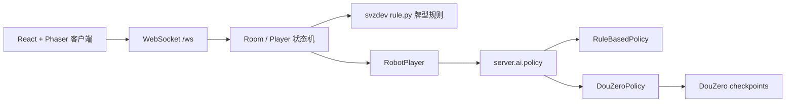

# 融合架构说明

## 来源

- 游戏基础：`svzdev/doudizhu`，Python Tornado 后端、React + Phaser 前端。
- AI 基础：`kwai/DouZero`，Apache-2.0，提供斗地主深度强化学习模型和评测代码。

## 模块边界

## 为什么先用策略适配层

DouZero 与 svzdev 的牌表示不同：

- svzdev 使用 1..54 的具体牌 id。
- DouZero 使用 rank 级别的环境牌值，如 `3..14, 17, 20, 30`。

二者还需要对齐地主位置、上下家位置、历史出牌、已出牌、底牌等状态。把这些放进 `server/ai/policy.py`，可以避免房间状态机、WebSocket 协议、前端 UI 被 AI 细节污染。

## 当前完成

- 保留 svzdev 原启发式机器人为 `RuleBasedPolicy`。
- 新增 `DouZeroPolicy`，负责检查 `DOUZERO_ENABLED`、`DOUZERO_MODEL_DIR`、模型文件和 Python 依赖。
- `RobotPlayer` 已改为通过策略接口出牌和抢地主。

## 待完成

- 实现 svzdev 牌局状态到 DouZero `InfoSet` 的转换。
- 实现 DouZero 动作到 svzdev 具体牌 id 的回映射。
- 补充 AI 策略单元测试和固定牌局回放测试。
- 桌面端打包时处理 Python 服务、模型文件和前端静态资源的生命周期。
